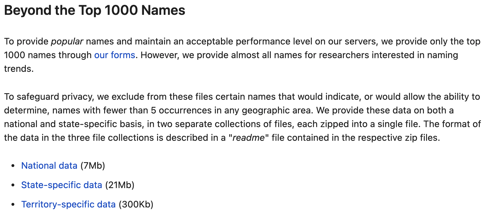

# Naming Trends by US State

Demonstration of a very simple data set that cannot be easily handled by Excel; however, it is very easy to handle this data set in R.

### Data Source

Source data come from [here](https://www.ssa.gov/oact/babynames/limits.html) and are downloaded using the `vroom` package. As of 2020, there were 6,215,834 records. You should run `downloadData.R` before running the other files in this repos. *Note: For names at the national level see the [`babynames`](https://cran.r-project.org/web/packages/babynames/index.html) R package.*

### Notebook

The `USNamingTrends` notebook performs a cursory EDA, examining popular names and names shared by both sexes. See [here](https://colorado.rstudio.com/rsc/content/f2a8e080-e444-4d5e-9d89-4944741f0417/USNamingTrends.nb.html) for an example.

### Shiny App

The Shiny app displays counts by year for any name and any combination of states. See [here](https://colorado.rstudio.com/rsc/content/f7420606-0f5f-4f3d-8fde-1e1d099f6591/) for an example.
