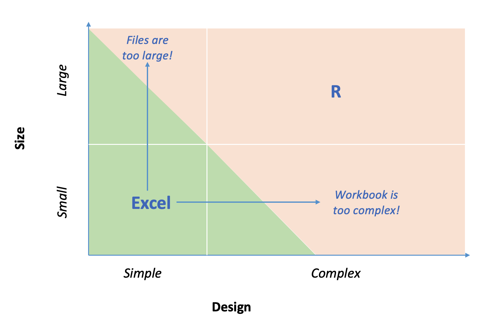

This presentation was called ["Scaling Spreadsheets with R""](https://www.meetup.com/RStudio-Enterprise-Community-Meetup/events/281142283/) and was delivered on October 13, 2021 as part of the [RStudio Enterprise Community Meetup](https://www.meetup.com/RStudio-Enterprise-Community-Meetup/) series. This presentation discusses what to do when your Excel workbook grows too large or too complex. 

This presentation is the second in a series about R and Excel. The first presentation was called ["How to Excel Without Excel"](https://www.rstudio.com/resources/webinars/how-to-excel-without-using-excel/) which used the [Customer Tracker](https://github.com/sol-eng/customer-tracker) in its demonstration. That presentation was delivered on November 13, 2019 at the EARL Boston Conference.
