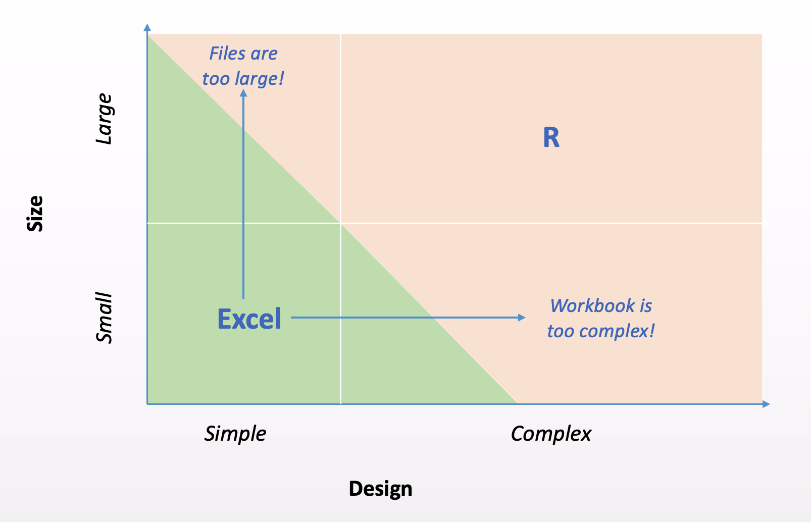
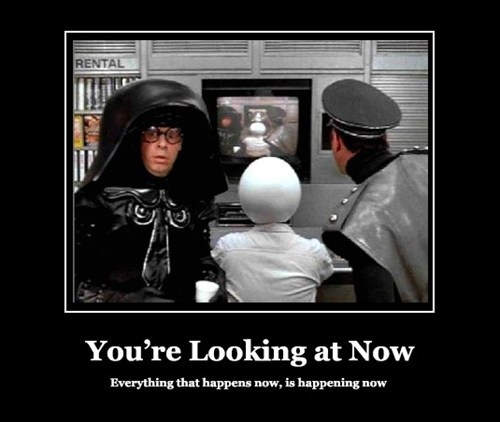

# Overview of Demos

These speaker notes are for a presentation called "[Scaling Spreadsheets with R](https://www.meetup.com/RStudio-Enterprise-Community-Meetup/events/281142283/)" delivered in October 2021 as part of the [RStudio Enterprise Community Meetup](https://www.meetup.com/RStudio-Enterprise-Community-Meetup/) series. This presentation discusses what to do when your Excel workbook grows too large or too complex.



# Demo 1: Files are too large

This demo demonstrates a very simple data collection (US state specific baby names) that is too large to be easily handled in Excel.

## Source Data

[Source data](https://www.ssa.gov/oact/babynames/limits.html) (51 files, 6,215,834 rows, 5 columns)

1.  Download
2.  Unzip
3.  Load into Excel

```{r}
download.file("https://www.ssa.gov/oact/babynames/state/namesbystate.zip","namesbystate.zip")
unzip("namesbystate.zip", exdir = "namesbystate")
```

## Issues in Excel

1.  Open all files by hand; headers missing
2.  Spinning wheel makes experience choppy
3.  Opening and saving takes 35 seconds (file size: 149 Mb)
4.  Filter drop-down list is limited to 10,000 but there are 32,110 names in all ([click for details](https://support.microsoft.com/en-us/office/excel-specifications-and-limits-1672b34d-7043-467e-8e27-269d656771c3))
5.  Cannot combine all files (max rows: 6,215,834)

## Read Data into R

You can read data from Alaska into R with the "Import Dataset" feature in the environment pane. That wizard will help you write this code for you:

```{r}
library(readr)
AK <- read_csv("namesbystate/AK.TXT", col_names = FALSE, col_types = cols(X2 = col_character()))
```

## Analyze Data

Use `dplyr`, `tidyr`, and `ggplot2` to analyze the data for Alaska.

```{r}
library(dplyr)
library(tidyr)
filter(AK, X4 == "Jessie")
filter(AK, X4 == "Jessie") %>% pivot_wider(names_from = X2, values_from = X5)
filter(AK, X4 == "Jessie") %>% ggplot(aes(X3, X5, col = X2)) + geom_line()
```

## Reading and combining data with R

You can combine all the data into one data frame with the `vroom` package:

```{r}
library(vroom)
files <- dir("namesbystate", pattern = "*.TXT", full.names = TRUE)
dat <- vroom(files, col_names=c("state", "sex", "year", "name", "n"))
```

Write data out for use later with the Shiny app:

```{r}
vroom_write(dat, "app/namesbystate.csv", delim = ",")
```

## Status check

*Spaceballs 1987*

> This is now now. What happened to then? We passed then? When? Now! When will then be now? Soon!



## Exploratory analysis with R Notebooks

-   Read data
-   Aggregate data by name
-   Most popular names (1996)
-   Most popular names (2020)
-   Shared names

```{r}
rmarkdown::render("USNamingTrends.Rmd")
```

## Shiny App

```{r}
shiny::runApp("app")
```

# Demo 2: Workbook is too complex

The customer tracker demo was created and [delivered in 2018 at the EARL Boston conference](https://twitter.com/earlconf/status/1062392126166720514). This excel spreadsheet was so complex that it was hard to maintain and validate. The code can be found [Github](https://github.com/sol-eng/customer-tracker).

## Source Data

The original source data came from a common enterprise report system and contains pre and post sales metrics for customers.

## Excel Dashboard

The Excel workbook had numerous issues:

-   It took a long time to build (6+ weeks)

-   It was hard to maintain, because every week new data were coming in

-   It was hard to share because it was so large

-   Even the smallest changes required a lot of effort to incorporate

-   Most importantly, errors were hard to detect and resolve

## Shiny app

The Shiny app has the same functionality as the Excel dashboard, but with the following benefits:

-   The Shiny app took about 6 hours to build (not 6 weeks)

-   RStudio Connect makes sharing the Shiny app easy

-   The Shiny is easier to maintain and inspect for errors

-   Users can still download the Excel extract that they want from the Shiny app

## R Markdown Report

In this situation, a Shiny app is probably overkill. A simpler approach is to use parameterized R Markdown. Here are some of the benefits:

-   Parameters are coded at the top of the report instead of in Shiny UI inputs

-   The report is static, so it's easier to host, share, and snapshot

-   The reports and any Excel attachments can be emailed to other decision makers
